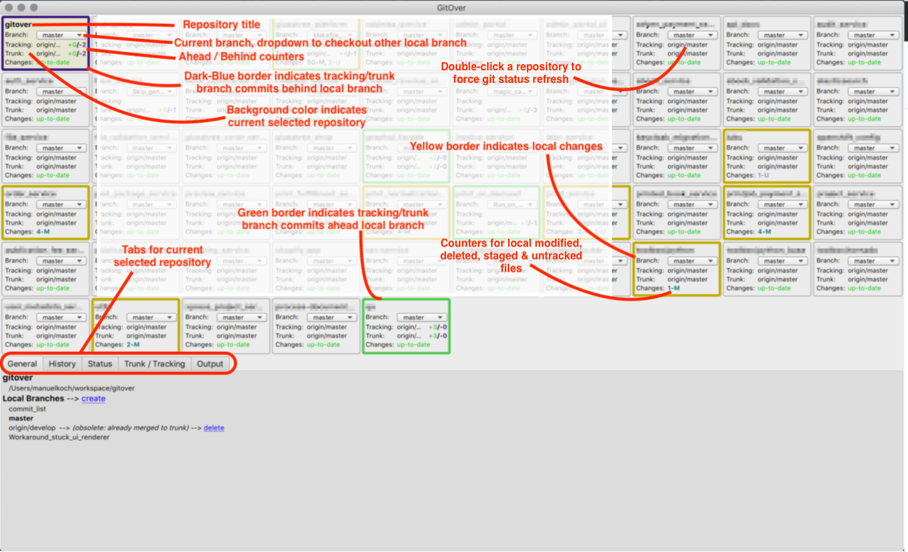

GitOver
=======

Show overview of multiple git repositories incl. sub-repositories and provide basic
git interactions :

* Show current branch
* Show current branch's tracking/remote branch and ahead/behind counters
* Show current branch's trunk branch and ahead/behind counters
* Show remote branches
* Show status info for modified, staged, untracked, deleted or conflicting files
* Checkout to another local branch by selecting a local branch from dropdown list
* Basic git functions like
    * status
    * fetch
    * pull
    * push (forced)
    * show diff of changed files
* Customizable context menu to trigger functionality, e.g. to start terminal or tool
  at current repositories root
* Automatically update repository status when filesystem changes are detected

## GitOver makes use of...

* [Python][1]
* [PyQt5][2], to implement a cross platform UI
* [GitPython][3], to display repository info and trigger git actions
* [PyInstaller][4], to bundle an easy to distribute application bundle
* [fswatch][5], to track changes in filesystem

## Screenshots



## Customize GitOver

GitOver uses a configuration file that can be placed in your home directory
or in a directory hierarchy that includes your git repositories.

E.g. if your repository is located at `~/workspace/gitover` then GitOver will search
`.gitover` in the following directories, first match is used :

- ~/workspace/gitover
- ~/workspace
- ~
- asf.

The configuration file should be named `.gitover` and contains YAML formatted
entries, for example

```
general:
    # where to find `git` executable
    git: /usr/local/bin/git
    # # optional (default = "fswatch"), where to find `fswatch` executable.
    # fswatch: /usr/local/bin/fswatch
    # # optional (default = "true"), whether to use just one instance of fswatch to watch all repositories
    # # or use one instance of fswatch per repository.
    # fswatch-singleton: "true"
    # # optional (default = <NOF_CORES> * 2)
    # task-concurrency: 8
    # # optional (default = ""), write logging to given path
    # debug-log: ~/tmp/gitover.log

repo_commands:
    - name:  "finder"
      title: "Finder"
      cmd:   "open '{root}'"
    - name:  "shell"
      title: "Shell"
      cmd:   "open -a iTerm '{root}'"
    - name:  "gitk"
      title: "Gitk"
      cmd:   /usr/local/bin/gitk
    - name:  gitgui
      title: "Git Gui"
      cmd:   "/usr/local/bin/git gui"
status_commands:
  conflict:
    - name:  "mergetool_bc"
      title: "Merge (bc)"
      cmd:   "git mergetool --tool=beyondcompare -y '{path}'"
  modified:
    - name:    "atom"
      title:   "Edit with Atom"
      cmd:     "/usr/local/bin/atom '{path}'"
    - name:    "subl"
      title:   "Edit with Sublime"
      cmd:     "/Users/manuelkoch/bin/subl '{path}'"
    - name:    "backup"
      title:   "Backup to *.modified"
      cmd:     "mv '{path}' '{path}'.modified"
  untracked:
    - name:    "atom"
      title:   "Edit with Atom"
      cmd:     "/usr/local/bin/atom '{path}'"
    - name:    "subl"
      title:   "Edit with Sublime"
      cmd:     "/Users/manuelkoch/bin/subl '{path}'"
```

### Section `general`

`debug-log`: Create detailed logfile at given path

`task-concurrency`: Use given number of background tasks for git actions like fetch/status or commit details

`git`: Configure which git executable will be used

`fswatch`: Configure which fswatch executable will be used

`fswatch-singleton`: Only use one instance of fswatch to track all filesystem changes

### Section `repo_commands`

Can contain a list of repository commands/tools that will be shown when opening
context menu within a repository-widget.

Each command has keys:

* `name`: The name of the command
* `title`: The title of the command, will be displayed in the context menu entry
* `cmd`: The command to be executed

The `cmd` argument supports expansion of repository depending strings :

* `{root}` will get expanded to current repository's root directory
* `{branch}` will get expanded to current repository's branch
* `{trackingbranch}` will get expanded to current repository's tracking branch
* `{trunkbranch}` will get expanded to current repository's trunk branch

### Section `status_commands`

Can contain a list of repository commands/tools for each status
that will be shown when opening context menu within the status tab
of currently selected repository-detail area.

The `cmd` argument supports same expansion of repository depending strings
as `repo_commands` and additionally :

* `{path}` will get expanded to relative path within current repository

## GitOver's notion of _trunk_ branch

GitOver uses concept of trunk branch to check for updates of contributed changes to
current repository during software development.
I.e. your teammates may continue to deliver new stuff on _master_ branch.
By setting the git config variable `gitover.trunkbranch` to _origin/master_ you can tell
GitOver which _trunk_ branch is for this repository to get notified when there are
changes that you could incorporate into your current local branch to keep up to date with
the trunk branch.

## GitOver fails to start after major OS update/upgrade

Double clicking the GitOver app doesn't start it - instead it crashes silently.
It may still run when starting it explicitly on console.
Cause may be misconfigured or not yet installed XCode stuff after
Mac OSX upgrade ( i.e. to High Sierra ).
You may need to reinstall XCode stuff to get git working again, [see][6].

## Build / bundle prerequisites

* `pip install --upgrade pip`
* `pip install pip-tools wheel`

[1]: https://docs.python.org "Python"
[2]: http://pyqt.sourceforge.net/Docs/PyQt5/ "PyQt5"
[3]: http://gitpython.readthedocs.io/en/stable/ "GitPython"
[4]: http://www.pyinstaller.org/ "PyInstaller"
[5]: https://github.com/emcrisostomo/fswatch "fswatch"
[6]: http://www.linuxuk.org/post/fixing_git_on_macOS_Sierra/
